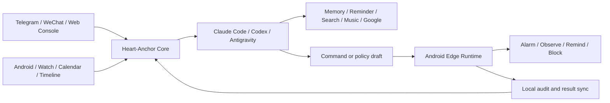

# Heart-Anchor

**让 Agent 不只聊天，而是持续理解你的生活，并通过手机与个人工具真正执行任务。**

Connect Claude Code, Codex, Telegram, WeChat and Android into one personal life-operations agent.

[](https://github.com/erisonw/Heart-Anchor/actions/workflows/ci.yml)
[](./package.json)
[](./clients/heart-anchor-mobile)
[](./LICENSE)

[快速开始](#五分钟启动) · [Android Edge Runtime](#android-edge-runtime) · [安全模型](#安全与控制权) · [文档导航](#文档导航)

<!-- README_MEDIA: 在这里加入项目总览 GIF，建议路径 assets/readme/hero-demo.gif。 -->

Heart-Anchor 是一个可自托管的个人 Agent 桥接系统。云端或本机 Agent 负责理解、记忆和规划，Android 执行节点负责持有设备权限、离线执行规则并回传结果；Telegram、WeChat 和 Web Console 则提供随手可用的控制入口。

它不是另一个聊天 UI，而是把 Agent 接入真实工作区、手机能力和个人上下文的运行层。

## 一个真实场景

你在 Telegram 或微信中说：

> 今晚十点后抖音最多使用二十分钟，明早七点半叫我。

Heart-Anchor 可以把这句话拆成两个可执行动作：

1. 创建一条等待手机确认的专注策略。
2. 向已配对手机下发七点半的闹钟命令。
3. 手机确认策略后，本地持续统计使用时长；即使暂时断网，提醒或限制仍可执行。
4. 执行、失败、绕过和临时解锁均进入可审计记录。



## 为什么是 Heart-Anchor

普通聊天机器人通常在一次回复后结束。Heart-Anchor 更关注三个长期问题：

- **上下文连续性**：绑定真实 workspace、runtime thread、长期记忆、timeline 和提醒，而不是每次从空白对话开始。
- **现实执行力**：通过 Android Edge Runtime、系统命令和个人工具，把计划变成可以确认、执行、撤销和审计的动作。
- **主动但可控**：设备事件和定时触发可以主动唤醒 Agent，但权限不会自动扩大，高风险行为仍由用户确认。

## 核心能力

| 方向 | 当前能力 | 状态 |
| --- | --- | --- |
| Agent Runtime | Claude Code、Codex 的线程、审批、停止、压缩与模型切换 | Stable |
| 聊天入口 | Telegram 文本/文件/语音，WeChat 扫码、消息与文件桥接 | Stable / Beta |
| Android Edge | 二维码配对、设备凭证、能力注册、离线专注策略、使用统计与 Power Mode | Beta |
| 手机命令 | 闹钟、计时器、FCM 唤醒与轮询补拉 | Beta |
| 主动上下文 | check-in、提醒、位置、Android 与手表事件、timeline | Beta |
| 长期记忆 | SQLite 三态记忆、混合召回、时间衰减、候选确认与夜间整理 | Stable |
| 个人工具 | Google Calendar/Gmail、网易云音乐、Web Search、TTS、文件与语音 | Beta |
| Web Console | 运行状态、会话、消息队列、记忆、集成授权、日志和设置 | Beta |
| Antigravity | CLI runtime 适配 | Experimental |

> `Stable` 表示核心链路已有持续回归测试；`Beta` 表示可用但仍依赖平台权限、第三方服务或设备兼容性；`Experimental` 表示接口可能调整。

<!-- README_MEDIA: 在这里加入三张截图：Web Console、二维码配对、专注拦截 Overlay。建议放在 assets/readme/。 -->

## Android Edge Runtime

`Heart-Anchor Mobile` 是独立 Android 执行节点，不与现有 Watch Bridge 共用包名或状态。

- Web Console 生成十分钟有效的一次性二维码。
- 每台设备获得独立、可撤销的随机凭证；服务端只保存哈希。
- 手机上报实际可用能力与权限状态，Agent 不假设权限已经存在。
- 新策略或策略 revision 必须在手机确认后才能生效。
- `observe`、`remind`、`block` 三种模式覆盖统计、提醒和硬限制。
- Accessibility Power Mode 只消费前台包名和窗口变化，不读取或上传界面正文。
- 硬限制可经系统身份验证临时解锁五分钟，并写入审计记录。
- 本地 Room、WorkManager 和重启恢复保证断网期间规则继续执行。

手机端位于 [`clients/heart-anchor-mobile`](./clients/heart-anchor-mobile)，完整配置与安全说明见 [Android Edge Runtime v2](./docs/android-edge-runtime-v2.md)。

Android 构建：

```bash
cd clients/heart-anchor-mobile
./gradlew :app:testDebugUnitTest :app:assembleDebug
```

## 五分钟启动

### 1. 准备环境

- Node.js `>= 22`
- 至少安装并登录一个 runtime CLI：`claude`、`codex` 或 `agy`
- Telegram Bot token，或可用的 WeChat bridge

### 2. 安装

```bash
git clone https://github.com/erisonw/Heart-Anchor.git
cd Heart-Anchor
npm ci
cp .env.example .env
```

### 3. 配置推荐入口：Telegram + Claude Code

在 `.env` 中至少填写：

```dotenv
HEART_ANCHOR_CHANNEL=telegram
HEART_ANCHOR_TELEGRAM_BOT_TOKEN=<your_telegram_bot_token>
HEART_ANCHOR_TELEGRAM_ALLOWED_CHAT_IDS=<your_chat_id>

HEART_ANCHOR_RUNTIME=claudecode
HEART_ANCHOR_CLAUDE_COMMAND=claude
HEART_ANCHOR_WORKSPACE_ROOT=/absolute/path/to/your/workspace
```

### 4. 检查并启动

```bash
npm run doctor
npm run check
npm run start
```

在 Telegram 给 Bot 发送消息即可。首次可以测试：

```text
只回复一次：文本正常
```

<details>
<summary><strong>使用 WeChat + Claude Code</strong></summary>

```dotenv
HEART_ANCHOR_CHANNEL=weixin
HEART_ANCHOR_RUNTIME=claudecode
HEART_ANCHOR_CLAUDE_COMMAND=claude
HEART_ANCHOR_ALLOWED_USER_IDS=<your_wechat_user_id>
HEART_ANCHOR_WORKSPACE_ROOT=/absolute/path/to/your/workspace
```

```bash
npm run login
npm run accounts
npm run start
```

</details>

<details>
<summary><strong>使用 Shared 模式</strong></summary>

Shared 模式让聊天入口和本机 runtime 共享同一个工作区线程，适合在手机、桌面终端和 Codex 之间连续协作。

```bash
npm run shared:start
npm run shared:open
npm run shared:status
```

</details>

完整环境变量及注释以 [`.env.example`](./.env.example) 为准。不要把真实 `.env`、Cookie、Bot token、API key 或聊天状态提交到仓库。

## 日常控制

### 本机命令

```bash
npm run start          # 启动 bridge 与内嵌 Web Console
npm run start:checkin  # 启动并开启主动 check-in
npm run doctor         # 检查运行环境
npm run login          # WeChat 扫码登录
npm run accounts       # 查看已登录账号
npm run web:console    # 主进程不可用时启动只读救援控制台
npm run shared:status  # 查看 Shared 模式状态
```

### 聊天命令

| 命令 | 作用 |
| --- | --- |
| `/new` | 新建 runtime thread |
| `/status` | 查看 runtime、线程、上下文和工作区状态 |
| `/reread` | 重新读取当前会话状态 |
| `/compact` | 请求压缩当前上下文 |
| `/stop` | 停止当前 turn |
| `/switch <threadId>` | 切换线程 |
| `/model [id]` | 查看或切换模型 |
| `/yes` / `/always` / `/no` | 处理运行时审批 |
| `/checkin <min>-<max>` | 设置主动 check-in 随机区间 |

更多命令与内部 action 见 [命令设计](./docs/commands.md)。

## 安全与控制权

Heart-Anchor 会接触真实聊天、设备和工作区，因此默认把控制权放在用户一侧：

- FCM 只发送“有任务可拉取”的唤醒信号，不携带命令正文。
- Android 设备使用独立凭证，不能读取或确认其他设备的命令。
- 新专注策略和策略变更只能生成草案，手机确认后才会激活。
- 手机可暂停云端命令；已确认的本地规则可以单独停用或删除。
- 命令包含 ID、过期时间、状态机和幂等结果回传。
- Web Console 默认只监听 `127.0.0.1`；监听公网地址前必须配置访问 token。
- 前期不包含任意 Shell、Device Owner、支付、短信、联系人或广泛 UI 自动化。

公开部署前请再次检查：

- `HEART_ANCHOR_STATE_DIR` 位于持久化目录。
- `.env` 只有服务用户可读。
- Android webhook、位置服务和 Web Console 均配置独立 token。
- Firebase、Google、TTS、搜索与音乐凭证不进入 Git 历史。

## 工作原理

主要模块：

```text
src/core/                 应用编排、配置、队列、turn gate 与主动触发
src/adapters/channel/     Telegram / WeChat 入口
src/adapters/runtime/     Claude Code / Codex / Antigravity runtime
src/services/             Android、记忆、提醒、Google、音乐、搜索、TTS 等服务
src/tools/                heart_anchor_tools MCP 工具注册
src/web-console/          内嵌控制台 API 与前端
clients/                  Android 手机和手表配套应用
test/                     Node.js 回归测试
```

模型通过项目原生 MCP 工具访问 timeline、diary、reminder、memory、文件、语音、搜索、Google 和 Android 能力。具体协议实现留在服务层，channel 与 runtime 只负责各自边界。

## Web Console

Web Console 默认随主进程启动在 `127.0.0.1:3210`，提供：

- runtime、线程、上下文和队列状态
- `/new`、`/reread`、`/compact` 等会话操作
- 长期记忆搜索、编辑、归档和候选确认
- Android 配对、设备能力、策略和活动记录
- Google OAuth、网易云登录及其他集成状态
- 实时日志与分级配置

云端推荐通过 SSH 隧道访问：

```bash
ssh -L 3210:127.0.0.1:3210 <server>
```

## 项目状态与路线

当前重点是把 Android 手机建设成可靠的现实执行节点：

1. **已落地**：安全配对、设备身份、能力注册、命令同步、结果回传和本地审计。
2. **持续完善**：应用使用统计、提醒、Accessibility Power Mode、离线策略与设备兼容性。
3. **下一阶段**：扩展低风险生活动作，统一手机、手表、日历、通知和 timeline 上下文。
4. **长期方向**：有限委托、多设备插件协议、权限预算、异常熔断和长期自治。

高风险能力不会因为路线扩展而默认开放。

## 文档导航

| 文档 | 内容 |
| --- | --- |
| [Android Edge Runtime v2](./docs/android-edge-runtime-v2.md) | 手机配对、权限、专注策略、安全与离线行为 |
| [Android Phone Bridge v1](./docs/android-phone-bridge-v1.md) | 闹钟与计时器命令链路 |
| [MacroDroid 接入指南](./docs/android-macrodroid-setup-guide.md) | Android 系统事件采集 |
| [Galaxy Watch7 v1](./docs/galaxy-watch7-v1-setup.md) | 心率、睡眠与手表桥接 |
| [命令设计](./docs/commands.md) | 聊天命令、内部 action 与 MCP 工具 |
| [系统架构](./docs/architecture.md) | Channel、Runtime、Core 与 capability 边界 |
| [Termius + tmux](./docs/termius-tmux-shared-terminal.zh-CN.md) | 手机终端共享工作流 |

## 开发与验证

```bash
npm run check
npm test
```

CI 会在每次 push 和 pull request 时执行相同检查。测试覆盖 runtime、channel、Android v1/v2、长期记忆、Web Console、个人工具和主动消息链路。

云端常驻推荐使用 systemd：

```ini
[Service]
WorkingDirectory=/opt/heart-anchor
EnvironmentFile=/opt/heart-anchor/.env
ExecStart=/usr/bin/npm run start
Restart=always
```

## 项目来源

Heart-Anchor 基于 [WenXiaoWendy/cyberboss](https://github.com/WenXiaoWendy/cyberboss) 持续演进。仓库保留 `CYBERBOSS_*` 环境变量前缀和 `~/.cyberboss` 状态目录兼容性，已有部署无需立即迁移。

感谢原项目提供的早期设计与基础框架。

## License

[AGPL-3.0-only](./LICENSE)
